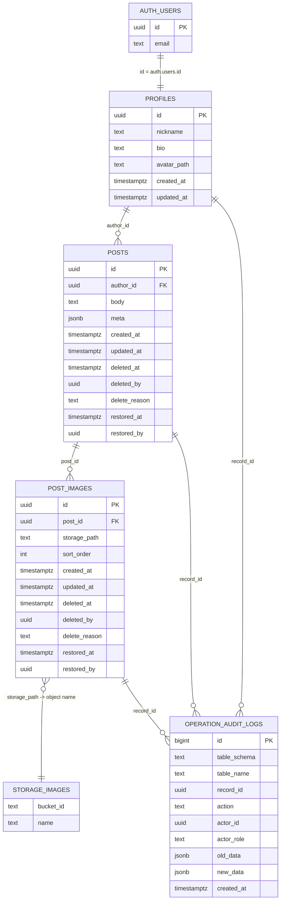

# 数据模型设计

本文描述徒步社群 MVP 的数据模型。当前阶段使用 Supabase，组合能力包括 Auth、Postgres、Storage 与 RLS。

## 设计目标

- 跑通核心闭环：注册/登录、编辑资料、发布图文动态、浏览动态流、查看详情、软删除。
- 图片原图一律放对象存储，数据库只保存引用路径，避免 Supabase 免费层数据库被二进制文件撑爆。
- 写操作使用服务端鉴权和数据库 RLS 双防线，防止越权修改他人数据。
- 为后续路线、地点、标签、审核、恢复、审计等能力保留演进空间。

## 总体关系



## 表说明

### auth.users

Supabase Auth 内置账号表，不由业务 migration 创建。

用途：

- 保存登录身份。
- 提供 `auth.uid()` 给 RLS 判断当前用户。
- 通过 trigger 在用户创建后自动生成 `profiles` 记录。

业务代码不直接维护这张表，只通过 Supabase Auth API 注册、登录、登出。

### profiles

用户资料表。每个登录账号对应一条 profile。

核心字段：

| 字段 | 类型 | 说明 |
|---|---|---|
| `id` | `uuid` | 主键，同时引用 `auth.users.id` |
| `nickname` | `text` | 昵称，去空格后长度 1 到 30 |
| `bio` | `text` | 简介，最多 200 字符 |
| `avatar_path` | `text` | 头像对象存储路径，MVP 可为空 |
| `created_at` | `timestamptz` | 创建时间 |
| `updated_at` | `timestamptz` | 更新时间 |

设计点：

- `profiles.id` 与 `auth.users.id` 一一对应。
- `handle_new_user()` trigger 监听 `auth.users` 插入，自动创建资料。
- 默认昵称来自邮箱前缀，若没有邮箱则使用 `hiker`。
- 头像未设置时，前端使用昵称首字作为占位。

RLS：

- 所有人可读 profile。
- 只有本人可插入或更新自己的 profile。

### posts

动态主表。每条徒步动态一行，保存正文和作者关系。

核心字段：

| 字段 | 类型 | 说明 |
|---|---|---|
| `id` | `uuid` | 主键，默认 `gen_random_uuid()` |
| `author_id` | `uuid` | 作者，引用 `profiles.id` |
| `body` | `text` | 动态正文，最多 2000 字符 |
| `meta` | `jsonb` | 扩展元信息，默认 `{}` |
| `created_at` | `timestamptz` | 创建时间 |
| `updated_at` | `timestamptz` | 更新时间 |
| `deleted_at` | `timestamptz` | 软删除时间，空表示可见 |
| `deleted_by` | `uuid` | 执行软删除的用户 |
| `delete_reason` | `text` | 软删除原因 |
| `restored_at` | `timestamptz` | 恢复时间 |
| `restored_by` | `uuid` | 执行恢复的用户 |

设计点：

- `body` 只保存文本，不保存图片二进制。
- `meta` 预留给路线地点、标签、天气、强度等轻量扩展。例如：

```json
{
  "city": "杭州",
  "tags": ["周末短线", "新手友好"],
  "weather": "雨后"
}
```

- `deleted_at` 是动态是否展示的主判断。列表和详情只展示 `deleted_at is null` 的动态。
- 物理删除不是业务主路径，避免误删和审核无据可查。

索引：

- `posts_visible_created_at_idx`：未删除动态按时间倒序，用于首页动态流。
- `posts_author_visible_created_at_idx`：某个作者的未删除动态按时间倒序，用于个人主页。
- `posts_deleted_at_idx`：被删除动态排查和恢复使用。

RLS：

- 访客和用户只能读未删除动态。
- 作者可以读自己的动态。
- 插入时 `author_id` 必须等于 `auth.uid()`。
- 更新仅作者可做。
- 不开放物理 delete 策略。

### post_images

动态图片引用表。每张图片一行，只保存对象存储路径和排序。

核心字段：

| 字段 | 类型 | 说明 |
|---|---|---|
| `id` | `uuid` | 主键，默认 `gen_random_uuid()` |
| `post_id` | `uuid` | 所属动态，引用 `posts.id` |
| `storage_path` | `text` | Supabase Storage 中的对象路径 |
| `sort_order` | `integer` | 上传顺序，从 0 开始 |
| `created_at` | `timestamptz` | 创建时间 |
| `updated_at` | `timestamptz` | 更新时间 |
| `deleted_at` | `timestamptz` | 软删除时间，空表示可见 |
| `deleted_by` | `uuid` | 执行软删除的用户 |
| `delete_reason` | `text` | 软删除原因 |
| `restored_at` | `timestamptz` | 恢复时间 |
| `restored_by` | `uuid` | 执行恢复的用户 |

设计点：

- 一条动态最多 9 张图片。
- `sort_order` 约束为 `0 <= sort_order < 9`。
- `unique (post_id, sort_order)` 保证同一动态内排序不重复。
- 图片路径由应用层生成，格式为：

```txt
{userId}/{postId}/{sortOrder}.{ext}
```

示例：

```txt
26c...9a/4fa...21/0.jpg
26c...9a/4fa...21/1.webp
```

- `post_images.storage_path` 只是指针，真实文件在 `storage.objects` 对应的 `images` bucket 中。

外键策略：

- 第一版基础 SQL 使用 `on delete cascade`。
- 第二版增强 SQL 将外键调整为 `on delete restrict`，避免物理删除动态时自动级联删除图片记录。软删除和恢复由业务函数统一控制。

索引：

- `post_images_post_sort_idx`：按动态读取图片并按上传顺序排序。
- `post_images_visible_post_sort_idx`：读取未删除图片。
- `post_images_deleted_at_idx`：排查被删除图片。

RLS：

- 可见图片可公开读。
- 动态作者可读自己的图片。
- 动态作者可插入图片。
- 动态作者可更新图片软删除状态。
- 不开放物理 delete 策略。

### storage.buckets / storage.objects

Supabase Storage 内置表。业务 migration 会创建 `images` bucket。

`images` bucket 配置：

- public: `true`
- 单文件限制：10MB
- 允许 MIME：
  - `image/avif`
  - `image/gif`
  - `image/jpeg`
  - `image/png`
  - `image/webp`

Storage 策略：

- 所有人可以读取 `images` bucket。
- 登录用户只能上传到自己 `auth.uid()` 对应的一级目录下。
- 登录用户只能更新或删除自己目录下的对象。

路径约束很重要。应用层路径和 Storage policy 必须一致：

```txt
{uid}/{postId}/{n}.{ext}
```

### operation_audit_logs

第二版增强 SQL 新增的审计表，用于记录关键表的创建、更新、软删除、恢复和物理删除。

核心字段：

| 字段 | 类型 | 说明 |
|---|---|---|
| `id` | `bigint identity` | 主键 |
| `table_schema` | `text` | 被操作表的 schema |
| `table_name` | `text` | 被操作表名 |
| `record_id` | `uuid` | 被操作记录 id |
| `action` | `text` | `create` / `update` / `soft_delete` / `restore` / `delete` |
| `actor_id` | `uuid` | 操作用户 |
| `actor_role` | `text` | 操作角色 |
| `old_data` | `jsonb` | 操作前快照 |
| `new_data` | `jsonb` | 操作后快照 |
| `created_at` | `timestamptz` | 审计记录时间 |

设计点：

- 这张表是 append-only 的审计记录，不参与正常业务读写。
- 通过 trigger 自动记录 `profiles`、`posts`、`post_images` 的变化。
- 应用层不应该依赖它实现业务逻辑。
- 当前只授权 `service_role` 读取。

## 触发器与函数

### set_updated_at()

统一维护 `updated_at` 字段。

触发表：

- `profiles`
- `posts`
- `post_images`

### handle_new_user()

监听 `auth.users` 插入，自动创建 `profiles`。

行为：

- 从邮箱前缀生成默认昵称。
- 若邮箱为空，则默认昵称为 `hiker`。
- 使用 `on conflict (id) do nothing` 避免重复创建。

### normalize_soft_delete_metadata()

第二版增强函数，用于归一化软删除和恢复元数据。

行为：

- `deleted_at` 从空变非空时，补 `deleted_by`。
- `deleted_at` 从非空变空时，补 `restored_at` 和 `restored_by`。

### record_row_audit()

第二版增强函数，用于写入审计日志。

行为：

- insert 记为 `create`
- delete 记为 `delete`
- `deleted_at` 从空变非空记为 `soft_delete`
- `deleted_at` 从非空变空记为 `restore`
- 其他 update 记为 `update`

### soft_delete_post()

业务软删除动态，同时联动软删除该动态下的图片。

```sql
public.soft_delete_post(p_post_id uuid, p_reason text default null)
```

### restore_post()

恢复已软删除动态，同时联动恢复图片。

```sql
public.restore_post(p_post_id uuid)
```

### soft_delete_post_image()

软删除单张图片。

```sql
public.soft_delete_post_image(p_post_image_id uuid, p_reason text default null)
```

### restore_post_image()

恢复单张图片。

```sql
public.restore_post_image(p_post_image_id uuid)
```

## 数据流

### 注册

1. 用户通过 Supabase Auth 注册。
2. Supabase 写入 `auth.users`。
3. `on_auth_user_created` trigger 调用 `handle_new_user()`。
4. 系统自动写入 `profiles`。

### 发布动态

1. 服务端校验登录态。
2. zod 校验正文和图片数量、大小、类型。
3. 生成 `postId`。
4. 图片上传到 Storage `images` bucket。
5. 调用内容审核责任链。
6. 写入 `posts`。
7. 写入 `post_images`。
8. 如果数据库写入失败，应用层尽力删除已上传图片，避免孤儿文件。

### 读取动态流

1. 查询 `posts` 中 `deleted_at is null` 的记录。
2. 按 `created_at desc` 排序。
3. join 作者 `profiles`。
4. join `post_images` 并按 `sort_order` 排序。
5. 卡片展示正文前 100 字符，超出追加省略号。

### 删除动态

1. 作者触发删除。
2. 应用层更新 `posts.deleted_at`，或调用 `soft_delete_post()`。
3. 第二版 schema 会补齐删除元数据并写入审计表。
4. 动态流和详情不再展示该动态。

## 关键约束

- 用户只能更新自己的 profile。
- 用户只能创建 `author_id = auth.uid()` 的动态。
- 用户只能修改自己的动态。
- 用户只能给自己的动态插入图片。
- 图片必须放在 Storage，数据库只存 `storage_path`。
- 图片对象路径必须以用户 id 作为一级目录。
- 删除是软删除，不是物理删除。

## 当前边界

- MVP 不做点赞、评论、关注。
- MVP 不做路线轨迹、地图、PostGIS。
- MVP 不做 AI/RAG/pgvector。
- MVP 不做复杂媒体处理，如缩略图、EXIF、图片宽高。
- 动态扩展信息先放 `posts.meta`，等字段稳定后再考虑结构化拆表。

## 迁移执行顺序

SQL migration 必须按文件名顺序执行：

1. `supabase/migrations/20260624130000_hiking_community_mvp.sql`
2. `supabase/migrations/20260625163000_soft_delete_restore_audit.sql`

第一个文件创建基础表、RLS、Storage bucket 和基础策略。

第二个文件依赖第一个文件创建的表，用于增强软删除、恢复和审计能力，不能单独执行。

手动在 Supabase SQL Editor 执行后，建议刷新 PostgREST schema cache：

```sql
notify pgrst, 'reload schema';
```
